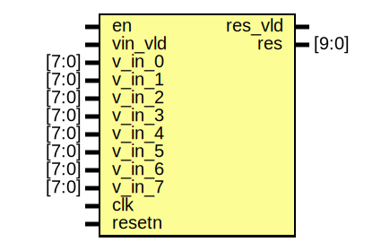

# Entity: cal_phase 

- **File**: cal_phase.v
## Diagram

## Ports

| Port name | Direction | Type  | Description |
| --------- | --------- | ----- | ----------- |
| en        | input     |       |             |
| vin_vld   | input     |       |             |
| v_in_0    | input     | [7:0] |             |
| v_in_1    | input     | [7:0] |             |
| v_in_2    | input     | [7:0] |             |
| v_in_3    | input     | [7:0] |             |
| v_in_4    | input     | [7:0] |             |
| v_in_5    | input     | [7:0] |             |
| v_in_6    | input     | [7:0] |             |
| v_in_7    | input     | [7:0] |             |
| res_vld   | output    |       |             |
| res       | output    | [9:0] |             |
| clk       | input     |       |             |
| resetn    | input     |       |             |
## Signals

| Name           | Type             | Description |
| -------------- | ---------------- | ----------- |
| calvn_vn_0     | wire [7:0]       |             |
| calvn_vn_1     | wire [7:0]       |             |
| calvn_vn_2     | wire [7:0]       |             |
| calvn_vn_3     | wire [7:0]       |             |
| calvn_vn_4     | wire [7:0]       |             |
| calvn_vn_5     | wire [7:0]       |             |
| calvn_vn_6     | wire [7:0]       |             |
| calvn_vn_7     | wire [7:0]       |             |
| calvn_vn_vld   | wire             |             |
| dot_psum_out1  | wire [15:0]      |             |
| dot_psum_out2  | wire [15:0]      |             |
| dot_psum_vld   | wire             |             |
| cordic_res     | wire [7:0]       |             |
| cordic_res_vld | wire             |             |
| _zz_3          | wire [8:0]       |             |
| _zz_4          | wire [8:0]       |             |
| _zz_5          | wire [8:0]       |             |
| _zz_6          | wire [8:0]       |             |
| _zz_7          | wire [0:0]       |             |
| _zz_8          | wire [8:0]       |             |
| _zz_9          | wire [9:0]       |             |
| _zz_10         | wire [9:0]       |             |
| _zz_11         | wire [9:0]       |             |
| _zz_12         | wire [9:0]       |             |
| vn_0           | wire [7:0]       |             |
| vn_1           | wire [7:0]       |             |
| vn_2           | wire [7:0]       |             |
| vn_3           | wire [7:0]       |             |
| vn_4           | wire [7:0]       |             |
| vn_5           | wire [7:0]       |             |
| vn_6           | wire [7:0]       |             |
| vn_7           | wire [7:0]       |             |
| vn_vld         | wire             |             |
| psum_out1      | wire [15:0]      |             |
| psum_out2      | wire [15:0]      |             |
| psum_vld       | wire             |             |
| ph_vld         | wire             |             |
| ph_cal         | wire [7:0]       |             |
| LastA2stZero   | reg              |             |
| ph_now         | reg        [7:0] |             |
| ph_last        | reg        [7:0] |             |
| ph_vld_dly1    | reg              |             |
| ph_delta       | wire [8:0]       |             |
| ph_delta_abs   | wire [8:0]       |             |
| AbsGtPi        | wire             |             |
| res_last       | reg        [9:0] |             |
| res_last_vld   | reg              |             |
| _zz_1          | wire [8:0]       |             |
| _zz_2          | wire [8:0]       |             |
## Processes
- unnamed: ( @ (posedge clk or negedge resetn) )
  - **Type:** always
## Instantiations

- calvn: cal_vn
- dot: dotVn
- cordic: cordic_int
